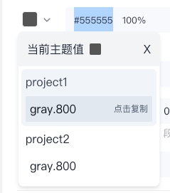
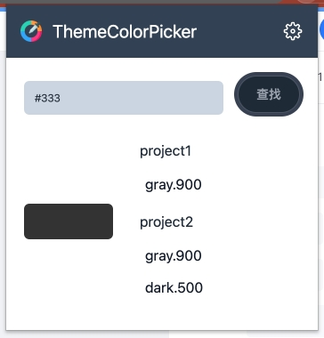
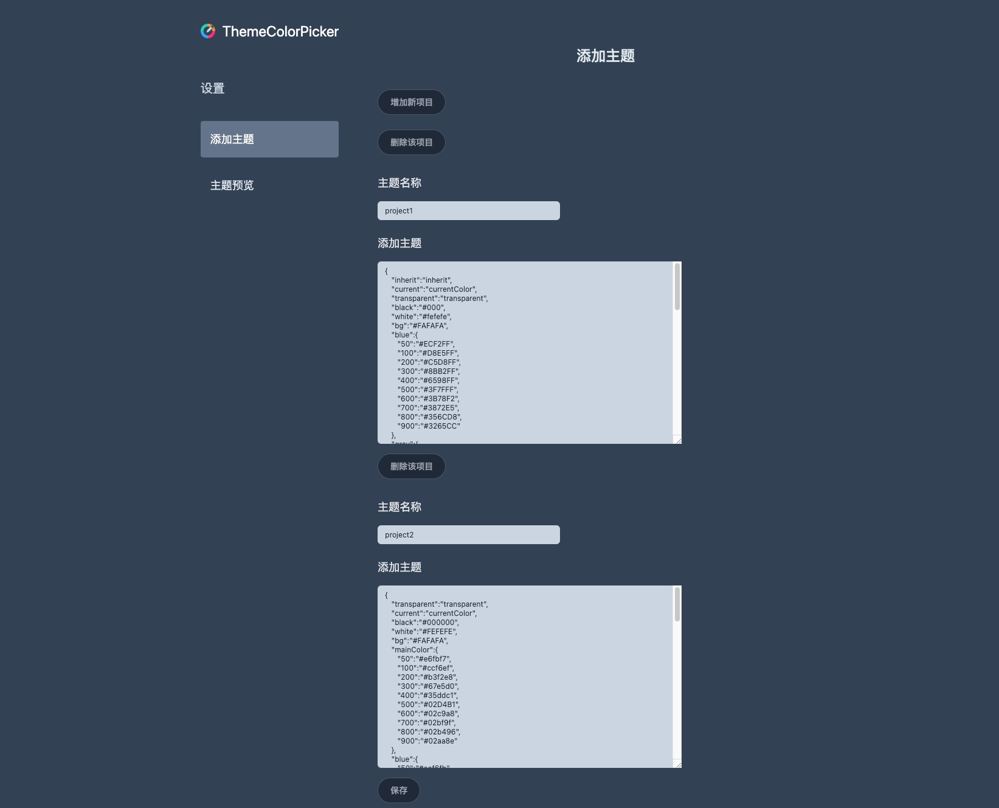

    
    <h1 align="center">Theme-color-picker</h1>

Theme-color-picker 是一个浏览器插件，可以让你在设计稿中快速找到主题中的颜色值，让你不再为记不住颜色烦恼

## 快速开始

通过 chrome webstor 或者直接下载 zip 文件，安装后设置项目主题即可使用

1. 安装插件
2. 设置项目主题
3. 在原型或者 UI 设计图中选择颜色

<!--  -->

## 安装

### Webstore 商店安装

### 手动安装

首先在 [release](https://github.com/yuhang1995/theme-color-picker/releases) 页下载相应版本的 `themeColorPicker.zip` 并解压

**Chrome 安装扩展：**

打开 `chrome://extensions/`

打开右上角 `开发者模式`

点击左上角 `加载已解压的扩展程序`

选择解压出的 `dist` 目录
